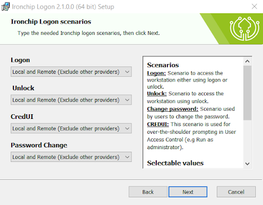
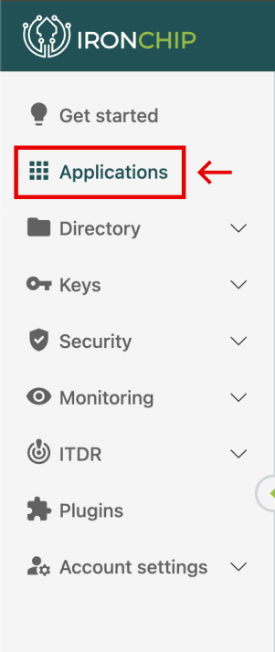

<p align="center">
  
</p>
<h1 align="center">Ironchip Windows Logon</h1>

<p align="center" back>
    <a href="https://www.microsoft.com/software-download/">
    
  </a>
</p>

## IDENTITY PROTECTION

Elevate your cybersecurity strategy with Ironchip Identity Platform, designed to bring the power of Multi-Factor Authentication (MFA) to your desktop computing environment. [Know more](https://www.ironchip.com/en/mobileless-authentication).

**Role-based privilege management:**
Set different user privileges. Prevents unauthorized users from accessing the rest of the system and misusing information, mitigating malicious users.

**Restrict access from unauthorized places:**
Generate enabled access from authorized areas and take your security to the next level.

**Supervision of accesses in real time:**
Check user activity, view access on a timeline, get reports and download them for full control.

**Intrusion detection system (IDS):**
Location-based reporting system to alert of sim swapping, phishing, device switching, etc.

## Logon

### What it is
Logon is a custom Windows credential provider designed by [Ironchip](https://www.ironchip.com/) to bring the power of Multi-Factor Authentication (MFA) to your desktop computing environment.

**Cached Passwords:**
Our simplified access can enhance user experience, making it more convenient and user-friendly. This is especially valuable in a work or personal environment where you're required to log in to various systems multiple times a day.

**Extra Layer:**
MFA adds an extra layer of protection, requiring multiple forms of authentication, such as a password and a one-time code or push notification. 

**Improved Compliance:**
MFA helps organizations meet compliance requirements and security standards by implementing robust authentication methods.

## Download

Download the latest installer (`.msi`) version from [Release](https://github.com/Ironchip-Security/Ironchip-Windows/releases).

### Requirements
To run the .msi file, the Microsoft Visual C++ Redistributable must be installed. You can download it from the [official Microsoft website](https://learn.microsoft.com/en-us/cpp/windows/latest-supported-vc-redist?view=msvc-170).

Download the appropriate .exe file for your system architecture.
Run the installer and follow the on-screen instructions.

### Installation process using UI

To install Ironchip Windows Logon into your device:
 1) Run the downloaded installer. This will open the installer stepper:
   <p align="center">
     
   </p>
 
 2) Follow the installation steps until you arrive to the **Ironchip Configuration View**. You must provide a valid **APIKEY** generated from the [Ironchip Dashboard](https://app.ironchip.com/).

   <p align="center">
     
   </p>

  > I case your Ironchip company is in an other environment, make sure to update the host in orther target the expected endpoints (*e.g https://testing.api.ironchip.com* is the host for the testing environment).

 3) On the next step you can enable additional features.
    
    - **Remember user:** Enable during the windows login a feature that allows to remember password for future logins.
    - **UPN:** Make sure to enable this if you device is configured to folow this format. If not keep it uncheck.
   
   <p align="center">
     
   </p>

 4) On this view, you can select in wich scenarios you want Ironchip credential provider to be applied.
  
    #### Scenarios
      - **Logon:** Scenario to access the workstation either using logon or unlock.
      - **Unlock:** Scenario to access the workstation using unlock.
      - **Change password:** Scenario used by users to change the password.
      - **CREDUI:** This scenario is used for over-the-shoulder prompting in User Access Control (e.g Run as administrator).

    #### Selectable values
      - **None:** Disables Ironchip credential provider.
      - **Local:** Apply Ironchip credential when accessing the machine locally.
      - **Remote:** Apply Ironchip credential when accessing the machine remotely (RDP).
      - **Exclude other providers:** Only allow the use of Ironchip, disable any other credential provider.

   <p align="center">
     
   </p>

  - Once the installation process is finished. Make sure to add the according access to the Ironchip Dashboard in order to be able to access the device.

### Installation process using CLI
The installation of Ironchip Windows Logon using commands (cmd) with the program "msiexec.exe." Here’s a basic tutorial on how to do it:

1) Open the command line (cmd):
    - Press Win + R to open the `Run` dialog.
    - Type `cmd` and press Enter.
2) Locate the MSI file:
    - Make sure you have the MSI file you want to install in an accessible location from the command line.
3) Execute the msiexec command:
    - The basic command to install an MSI file is as follows:

    ```bash
    msiexec.exe /i Path\To\IronchipWindowsLogon.msi IRONCHIP_SECRET="$apikey" IRONCHIP_URL="https://api.ironchip.com" IRONCHIP_REMEMBER_CREDENTIALS="1" IRONCHIP_UPNFORMAT="0" CPUS_LOGON="3d" CPUS_UNLOCK="3d" CPUS_CREDUI="3d" CPUS_CHANGE_PASSWORD="3d"  /q
    ```

    > Replace `Path\To\IronchipWindowsLogon.msi` with the full path and name of the MSI file. 
    
    > The only required values is `IRONCHIP_SECRET` any other values is only required if you want to modify the default values

    **Scenario values [0|1|2|3][e|d]**
    - **0:** Apply Ironchip credential when accessing the machine localy and remotely
    - **1:** Apply Ironchip credential when accessing the machine remotely (RDP)
    - **2:** Apply Ironchip credential when accessing the machine localy
    - **3:** Disables Ironchip credential provider
    - **e:** Only allow the use of Ironchip, disable any other credential provider
    - **d:** Allow other providers

4) Wait for it to finish:
    - The installation process may take some time. Stay in the command line until you see the prompt indicating that the installation is complete.

## How do i get my ApiKey?
### Requirements

1) Have a company created on the Ironchip Dashboard. If you don't have an Ironchip Company yet, feel free to [check it out](https://www.ironchip.com/en/identity-platform)

2) Have permissions on the company to create a new application.

### Guide

1) Enter the [Ironchip Dashboard](https://app.ironchip.com/) with your company user.

2) Navigate to the Applications section
   <p align="center">
     
   </p>

3) Click on the **New Application** button and a new modal will be displayed. Fill the name and select **APIKEY** as the integration.
   <p align="center">
     
   </p>

4) Wait for the creation of the application. If able to generate the application, a new modal should show providing the apikey (only shows at this point, make sure to save it for later use) needed for the Ironchip Windows Logon.
   <p align="center">
     
   </p>

## How to give access?
### Requirements

1) Have a company created on the Ironchip Dashboard. If you don't have an Ironchip Company yet, feel free to [check it out](https://www.ironchip.com/en/identity-platform)

2) Have permissions on the company to grant access to applications.

### Guide

1) Enter the [Ironchip Dashboard](https://app.ironchip.com/) with your company user.

2) Navigate to the Applications section
   <p align="center">
     
   </p>

3) Click on the **Options** button and select **Add Access** and a new modal will be displayed. Fill the values of each step.
   <p align="center">
     
   </p>
> As a username, setup the same value the user will use to login into the Windows device.
