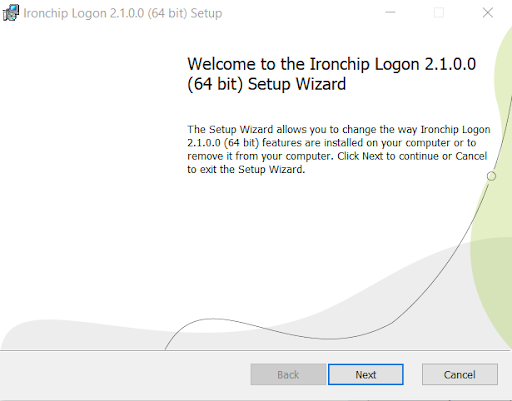
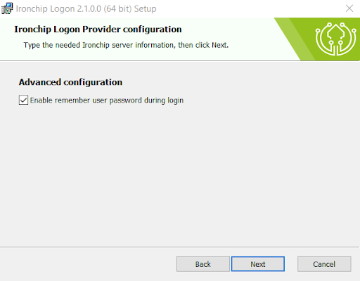
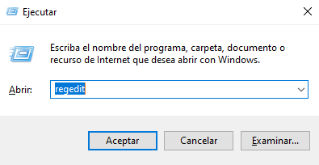

<p align="center">
  
</p>
<h1 align="center">Ironchip Windows Logon</h1>

<p align="center" back>
  <a href="https://www.microsoft.com/software-download/">
    
  </a>
  
  <a href="https://github.com/Ironchip-Security/Ironchip-Windows-Logon/releases/latest">
    
  </a>
  
  <a href="https://github.com/Ironchip-Security/Ironchip-Windows-Logon/releases/latest">
    
  </a>
</p>

<p align="center" back>
  
</p>


## IDENTITY PROTECTION

Elevate your cybersecurity strategy with Ironchip Identity Platform, designed to bring the power of Multi-Factor Authentication (MFA) to your desktop computing environment. [Know more](https://www.ironchip.com/en/mobileless-authentication).

**Role-based privilege management:**
Set different user privileges. Prevents unauthorized users from accessing the rest of the system and misusing information, mitigating malicious users.

**Restrict access from unauthorized places:**
Generate enabled access from authorized areas and take your security to the next level.

**Supervision of accesses in real time:**
Check user activity, view access on a timeline, get reports and download them for full control.

**Intrusion detection system (IDS):**
Location-based reporting system to alert of sim swapping, phishing, device switching, etc.

## Logon

### What it is
Logon is a custom Windows credential provider designed by [Ironchip](https://www.ironchip.com/) to bring the power of Multi-Factor Authentication (MFA) to your desktop computing environment.

**Cached Passwords:**
Our simplified access can enhance user experience, making it more convenient and user-friendly. This is especially valuable in a work or personal environment where you're required to log in to various systems multiple times a day.

**Extra Layer:**
MFA adds an extra layer of protection, requiring multiple forms of authentication, such as a password and a one-time code or push notification. 

**Improved Compliance:**
MFA helps organizations meet compliance requirements and security standards by implementing robust authentication methods.

  <p align="center">
     
  </p>


## Download
Download the latest (`.msi`) installer:

<p align="left">
  <a href="https://github.com/Ironchip-Security/Ironchip-Windows-Logon/releases/latest/download/IronchipWindowsLogon_x64.msi">
    
  </a>
</p>

### Basic Usage
Once you've downloaded the installer:

#### GUI Installation

1. Run the `.msi` installer.
2. Enable the features you need:
   - **Ironchip Windows Logon** for secure login.
   - *(Optional)* **Offline** for no-internet login.
   - *(Optional)* **Remember Credentials** to cache passwords.
3. Enter your `ApiKey` when prompted.
4. Finish setup and assign user access from the [Ironchip Dashboard](https://app.ironchip.com).

### Installation process using UI

To install Ironchip Windows Logon into your device:
 1) Run the downloaded installer. This will open the installer stepper:
   <p align="center">
     
   </p>
 2) Read and accept the Terms of Use.
    <p align="center">
     
   </p>

 3) Follow the installation steps until you arrive to the **Ironchip Configuration View**. You must provide a valid **APIKEY** generated from the [Ironchip Dashboard](https://app.ironchip.com/).

   <p align="center">
     
   </p>

  > I case your Ironchip company is in another environment, make sure to update the host in order to target the expected endpoints (*e.g https://testing.api.ironchip.com* is the host for the testing environment).

 4) On the next step you can enable additional features.
    
    - **Remember user:** Enable during the windows login a feature that allows to remember password for future logins.
   
   <p align="center">
     
   </p>

 5) On this view, you can select in which scenarios you want Ironchip credential provider to be applied.
  
    #### Scenarios
      - **Logon:** Scenario to access the workstation either using logon or unlock.
      - **Unlock:** Scenario to access the workstation using unlock.
      - **Change password:** Scenario used by users to change the password.
      - **CREDUI:** This scenario is used for over-the-shoulder prompting in User Access Control (e.g Run as administrator).

    #### Selectable values
      - **None:** Disables Ironchip credential provider.
      - **Local:** Apply Ironchip credential when accessing the machine localy.
      - **Remote:** Apply Ironchip credential when accessing the machine remotely (RDP).
      - **Exclude other providers:** Only allow the use of Ironchip, disable any other credential provider.

   <p align="center">
     
   </p>

  - Once the installation process is finished. Make sure to add the according access to the Ironchip Dashboard in order to be able to access the device.

### Installation process using CLI
The installation of Ironchip Windows Logon using commands (cmd) with the program "msiexec.exe." Here’s a basic tutorial on how to do it:

1) Open the command line (cmd):
    - Press Win + R to open the `Run` dialog.
    - Type `cmd` and press Enter.
2) Locate the MSI file:
    - Make sure you have the MSI file you want to install in an accessible location from the command line.
3) Execute the msiexec command:
    - The basic command to install an MSI file is as follows:

    ```bash
    msiexec.exe /i C:\IronchipWindowsLogon.msi IRONCHIP_SECRET="$api_key" IRONCHIP_REMEMBER_CREDENTIALS="1" CPUS_LOGON="0d" CPUS_UNLOCK="0d" CPUS_CREDUI="0d" CPUS_CHANGE_PASSWORD="0d"  /q
    ```

    > Replace `Path\To\IronchipWindowsLogon.msi` with the full path and name of the MSI file. 
    
    > The only required value is `IRONCHIP_SECRET`. Other values are optional and only needed to modify the defaults.

    **Scenario values [0|1|2|3][e|d]**
    - **0:** Apply Ironchip credential when accessing the machine localy and remotely
    - **1:** Apply Ironchip credential when accessing the machine remotely (RDP)
    - **2:** Apply Ironchip credential when accessing the machine localy
    - **3:** Disables Ironchip credential provider
    - **e:** Only allow the use of Ironchip, disable any other credential provider
    - **d:** Allow other providers

4) Wait for it to finish:
    - The installation process may take some time. Stay in the command line until you see the prompt indicating that the installation is complete.

## How do I get my ApiKey?
### Requirements

1) Have a company created on the Ironchip Dashboard. If you don't have an Ironchip Company yet, feel free to [check it out](https://www.ironchip.com/en/identity-platform)

2) Have permissions on the company to create a new application.

### Guide

1) Enter the [Ironchip Dashboard](https://app.ironchip.com/) with your company user.

2) Navigate to the Applications section
   <p align="center">
     
   </p>

3) Click on the **New Application** button and a new modal will be displayed. 

   <p align="center">
     
   </p>

4) Select the **Windows Logon** application integration.
   <p align="center">
     
   </p>

5) Fill the fields with the desired name (you can also customize the icon).
   <p align="center">
     
   </p>

4) Wait for the creation of the application. If able to generate the application, a new modal should show providing the apikey needed for the Ironchip Windows Logon (only shown at this point, make sure to save it for later use) .
   <p align="center">
     
   </p>

## How to give access?
### Requirements

1) Have a company created on the Ironchip Dashboard. If you don't have an Ironchip Company yet, feel free to [check it out](https://www.ironchip.com/en/identity-platform)

2) Have permissions on the company to grant access to applications.

### Guide

1) Enter the [Ironchip Dashboard](https://app.ironchip.com/) with your company user.

2) Navigate to the Applications section
   <p align="center">
     
   </p>

3) Click on the **Options** button and select **Add Access** and a new modal will be displayed. Fill the fields in each step.
   <p align="center">
     
   </p>
> As a username, setup the same value the user will use to login into the Windows device.

## Additional configurations

## One Time Password
To configure the OTP for a user, you nned to log into that user and execute the `Ironchip Offline Setup` shortcut:

   <p align="center">
     
   </p>

This will open a the OTP setup process

   <p align="center">
     
   </p>

continue with it until you arrive to the QR. Make sure to save the QR since it's how the user will be able to login to the account when there is no internet connection.

   <p align="center">
     
   </p>
   
## Exclude users
You can exclude users from being required to perform Ironchip authorization during login. To do so, go to the registry path: `Computer\HKEY_LOCAL_MACHINE\SOFTWARE\Classes\CLSID\{D2CBBFE7-22CC-4FF0-A7C4-8FCDCFB141B7}`

Add the usernames to the `ironchipExcludedUsers` entry.
> The format of the users exluded must be *MACHINE\User* or *DOMAIN\User* (make sure to jump line between users)
   <p align="center">
     
   </p>

### Autologon

If you’ve configured auto-login using Sysinternals [Autologon](https://learn.microsoft.com/en-us/sysinternals/downloads/autologon), and you don't exclude other providers, the default provider will be displayed. So in that case, if you want ironchip to be selected as the provider to use go to the policy `Local Group Policy Edit > ` and paste the Ironchip Logon GUID

1) Use the key shortcut `⊞ Win + R` and paste `gpedit.msc`
   <p align="center">
     
   </p>

2) Then inside the Local Group Policy Editor go to `Local Computer Policy > Computer Configuration > Administrative Templates > System > Logon > Assign a default credential providers`
   <p align="center">
     
   </p>

### Logs

The Ironchip Credential Provider generates diagnostic and operational logs to help with monitoring and troubleshooting. These logs are written to the Windows Event Viewer under Applications and Services Logs → [YourCompanyName] → CredentialProvider.

To view the logs:
1) Open Event Viewer (eventvwr.msc).
2) Navigate to `Windows logs>Applications`.
3) Look for logs comming from `IronchipLogon` and `Ironchip OTP Service`

#### Changing the Log Level
The log verbosity can be configured through the provider’s configuration registry `Computer\HKEY_LOCAL_MACHINE\SOFTWARE\Classes\CLSID\{D2CBBFE7-22CC-4FF0-A7C4-8FCDCFB141B7}` you can modify the value of `logLevel` with the values:
 - `error` – Logs only error events.
 - `warning` – Logs warnings and errors.
 - `info` – Logs general operational information, warnings, and errors.
 - `debug` – Logs detailed diagnostic information. **Not recommended** for regular use, as it can quickly fill the Event Viewer due to the volume of data. Use this level only when lower levels do not provide sufficient details for troubleshooting.
